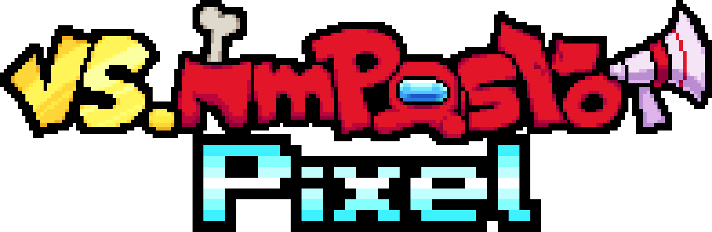

<h1 align="center">THIS README IS STILL A WORK IN PROGRESS</h1>

![License][license-shield] ![Release][release-shield] ![Repo Size][repoSize-shield] ![Stars][stars-shield]

    
    <h3>VS IMPOSTOR Pixel</h3> <!-- this is just here so the table of contents thing shows stuff properly -->
    
<b>Created by <a href="https://github.com/kenton54">kenton</a></b>

     
    

        <b>VS IMPOSTOR Pixel</b> is a <b><a href="https://ninja-muffin24.itch.io/funkin">Friday Night Funkin'</a></b> Modification based on the popular mod <b><a href="https://vsimpostor.com">VS IMPOSTOR</a></b> created by the team IMPOSTORM, which itself is based of the very popular game and cultural meme <b><a href="https://www.innersloth.com/games/among-us">Among Us</a></b> made by <b><a href="https://www.innersloth.com">Innersloth</a>.

    

     
    

        Downloads
         
        <b>
        <a href="https://gamebanana.com/mods/506768">Gamebana</a>
        &middot;
        <a href="https://drive.google.com/drive/folders/1D7bzf95Ig0HuAl6Zrm4iikSvv_Mc0cSm?usp=sharing">Google Drive</a>
        </b>
    

<h1 align="center">THE TEAM BEHIND THE MOD</h1>

## Director and Programmer
- [kenton](https://www.youtube.com/@kenton.54)

## Artists, Pixel-Artists and Animators
- [kenton](https://www.youtube.com/@kenton.54)
- [GTM]()

## Musicians
<table>
    <tr>
        <th>Musician</th>
        <th>Amount Composed</th>
    </tr>
    <tr>
        <th><a href="https://www.youtube.com/@SparklyYea">Sparkly</th>
        <th>4</th>
    </tr>
    <tr>
        <th><a href="">Silte</th>
        <th>0</th>
    </tr>
</table>

## Charters
<table>
    <tr>
        <th>Charter</th>
        <th>Amount Charted</th>
    </tr>
    <tr>
        <th><a href="https://www.youtube.com/@kenton.54">kenton</th>
        <th>17</th>
    </tr>
    <tr>
        <th><a href="">Kdead</th>
        <th>4</th>
    </tr>
</table>

## Translators
<table>
    <tr>
        <th>Translator</th>
        <th>Language</th>
    </tr>
    <tr>
        <th><a href="https://www.youtube.com/@kenton.54">kenton</th>
        <th>Spanish</th>
    </tr>
    <tr>
        <th><a href="">Moxt</th>
        <th>French</th>
    </tr>
    <tr>
        <th><a href="">mikeyguy</th>
        <th>Portuguese</th>
    </tr>
    <tr>
        <th><a href="">Fred</th>
        <th>Russian</th>
    </tr>
    <tr>
        <th><a href="">Video Fanmade Guy</th>
        <th>German</th>
    </tr>
    <tr>
        <th><a href="">Huy1234TH</th>
        <th>Vietnamese</th>
    </tr>
</table>

<!-- MARKDOWN LINKS & IMAGES -->
<!-- https://www.markdownguide.org/basic-syntax/#reference-style-links -->
[repoSize-shield]: https://img.shields.io/github/repo-size/kenton54/VS-IMPOSTOR-Pixel?style=for-the-badge
[stars-shield]: https://img.shields.io/github/stars/kenton54/VS-IMPOSTOR-Pixel?style=for-the-badge
[license-shield]: https://img.shields.io/github/license/kenton54/VS-IMPOSTOR-Pixel?style=for-the-badge
[release-shield]: https://img.shields.io/github/v/release/kenton54/VS-IMPOSTOR-Pixel?display_name=release&style=for-the-badge
