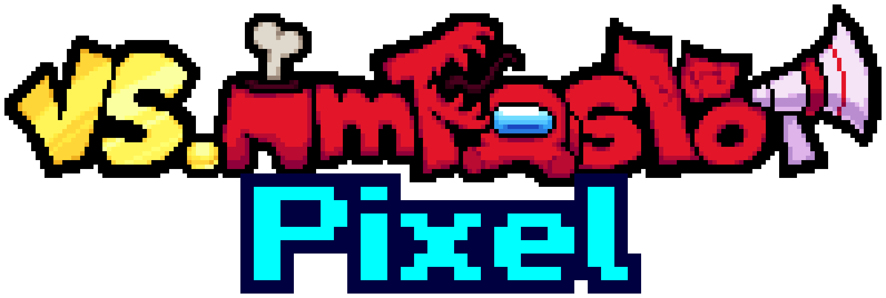

    <a href="https://github.com/kenton54/VS-IMPOSTOR-Pixel">
        <picture>
            <source media="(prefers-color-scheme: dark)" srcset=".artwork/github/logo-dark-scaledx10.gif">
            <source media="(prefers-color-scheme: light)" srcset=".artwork/github/logo-light-scaledx10.gif">
            
        </picture>
    </a>
    <h1>VS IMPOSTOR Pixel</h1> <!-- this is just here so the table of contents thing shows stuff properly (???) -->
    
<b>Created by <a href="https://github.com/kenton54">kenton</a></b>

     
    

        <b>VS IMPOSTOR Pixel</b> is a <a href="https://ninja-muffin24.itch.io/funkin">Friday Night Funkin'</a> mod based of the mod <a href="https://vsimpostor.com">VS IMPOSTOR</a> created by the team MotorFrog, which itself is based of the popular game <a href="https://www.innersloth.com/games/among-us">Among Us</a> made by <a href="https://www.innersloth.com">Innersloth</a>.
    

     
    

        The mod is fully compatible with Desktop and Mobile devices!
    

     
    

        Downloads
         
        <b>
        <a href="https://gamebanana.com/mods/506768">GameBanana</a>
        &middot;
        <a href="https://kenton54.itch.io/vs-impostor-pixel">Itch.io</a>
        &middot;
        <a href="https://gamejolt.com/games/vsimpostorpixel/1079175">GameJolt</a>
        &middot;
        <a href="https://drive.google.com/drive/folders/1D7bzf95Ig0HuAl6Zrm4iikSvv_Mc0cSm?usp=sharing">Google Drive</a>
        </b>
    

<h1 align="center">STORY</h1>
After Boyfriend finished his adventure across the VS IMPOSTOR universe, it's time for him to face off against Black Impostor in one epic final song!!11!1!

But after winning, Black refuses to admit defeat! In one last desperate attempt, he tries to kill Boyfriend, but he's too elusive for him! Boyfriend dodges every single one of his attacks and escapes! But he doesn't get too far thanks to the floor breaking apart around him, Black now has him cornered!

Reality started breaking around them. Boyfriend notices how the breaking floor behind him turned into a giant seemingly bottomless void, with no other option, he jumps into it, finally escaping from Black's clutches!

Black, seeing how his prey managed to find a way to escape from him AGAIN, decides to reset the entire timeline, back to where everything began, to have a better chance of catching Boyfriend and make him pay for all the mockery he has made of Black. But something didn't go according to his plan... everything is now pixelated!

Now Boyfriend has to go through all of the past lobbies he ventured already, meeting the same crew and impostors he once fought against valiantly, but now with new challenges and new dangerous foes to battle against, all in a different visual style! Will Boyfriend succeed once again? or will Black succeed this time and finish him off?

<h1 align="center">CREDITS</h1>

## Director

- kenton

## Artists, Pixel-Artists and Animators

- kenton
- GTM

## Programmers

- kenton

## Musicians

- Sparkly
- Oxzy
- Silte
- VoltR

## Charters

- kenton

## Translators

<table>
    <tr>
        <th>Translator</th>
        <th>Language</th>
    </tr>
    <tr>
        <td>kenton</td>
        <td>Spanish</td>
    </tr>
    <tr>
        <td>Moxt</td>
        <td>French</td>
    </tr>
    <tr>
        <td>Wøvenx</td>
        <td>Portuguese</td>
    </tr>
    <tr>
        <td>FuniFred</td>
        <td>Russian</td>
    </tr>
    <tr>
        <td>JustAlexus</td>
        <td>German</td>
    </tr>
    <tr>
        <td>Huy1234TH</td>
        <td>Vietnamese</td>
    </tr>
</table>
